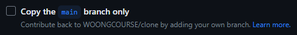

# 웅이야 1학년 프론트엔드 과제

## 📆 기간 : 2023.09.03 ~ 2023.10.1 (4주)

## 1차 과제 : 2023.09.03 ~ 2023.09.17

## 2차 과제 : 2023.09.18 ~ 2023.10.1

1차 과제는 개념을 공부하는 기간이며, 2차 과제는 1차 과제에서 배운 개념을 활용해 무언가를 만드는 기간입니다.

## 깃허브

- 위 레포지토리를 포크하여 포크된 레포지토리를 클론한 뒤 **본인 브랜치에서** 개발합니다.

  > 꼭!!! 레포지토리를 포크할 때 해당 옵션을 체크 해제해 주셔야 됩니다!!
  > 

- 과제 기간 사이에 자신의 깃허브 아이디와 같은 이름의 브랜치를 생성하여 위 레포지토리에 Pull Request(PR)를 생성합니다. 이 때 PR의 제목은 "[과제]차정원 과제 제출합니다" 와 같은 형식으로 PR을 생성합니다. PR의 내용에는 자신의 느낀점이나 질문을 작성합니다.

## 커밋 룰

|          |                                                    |
| :------: | :------------------------------------------------: |
|   type   |                    description                     |
|   ADD    | 새로운 기능, 컴포넌트 등 새로운 것이 추가되었을 때 |
|   FIX    |      기존의 코드에서 잘못된 부분을 수정할 때       |
| REFACTOR |       기존의 있는 코드를 리팩토링 하였을 때        |
|  DELETE  |          기존의 있던 내용을 삭제하였을 때          |

# 예시

```bash
git commit -m 'ADD: 사이드 바 컴포넌트 추가'
git commit -m 'FIX: 스토리 섹션 스크롤 방향 수정'
git commit -m 'REFACTOR: 코드 가독성을 높이기 위한 리팩토링'
git commit -m 'DELETE: 사용하지 않는 태그 삭제'
```
